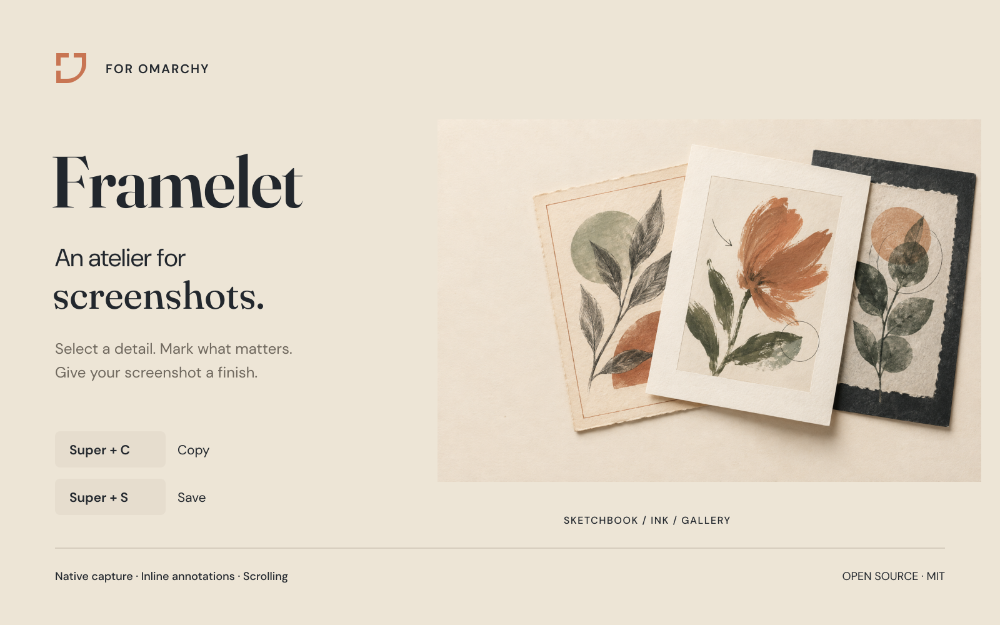
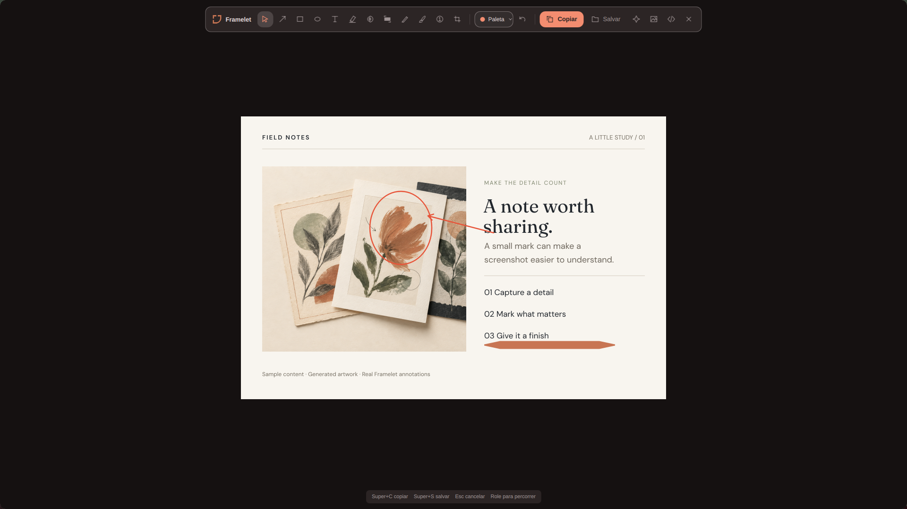
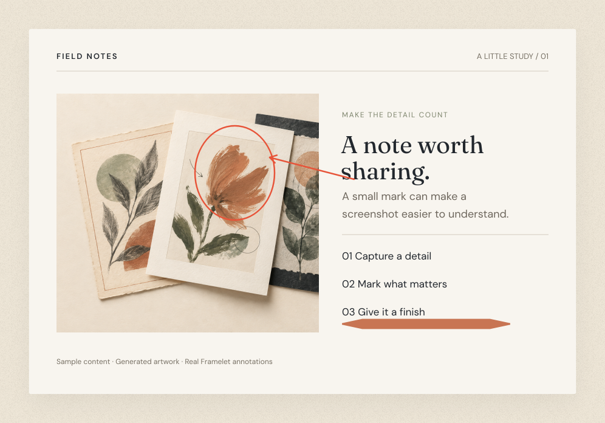
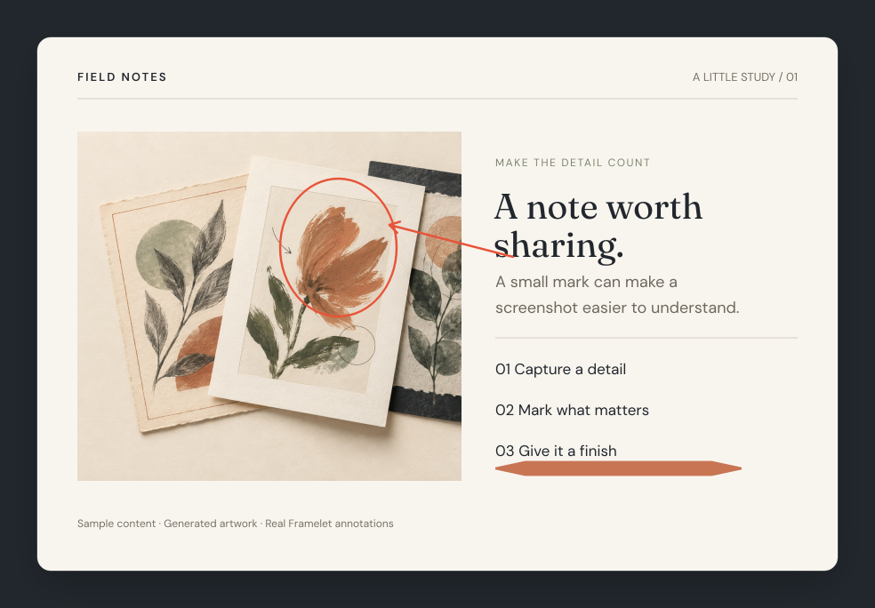
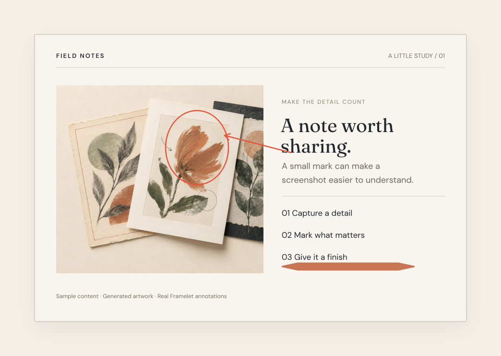
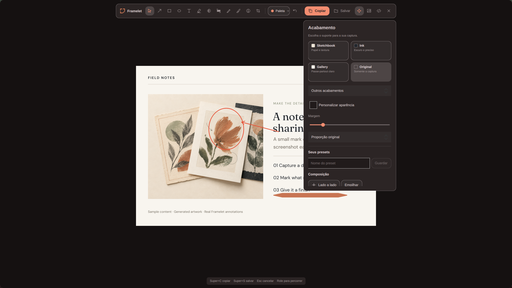

<p align="center">
  
</p>

<h1 align="center">Framelet</h1>
<p align="center"><strong>Select. Annotate. Make it yours.</strong></p>
<p align="center">A native screenshot atelier for Omarchy. Draw on the capture, give it a finish, then copy or save — all in the same overlay.</p>
<p align="center"><a href="#install">Install</a> · <a href="#three-ways-to-finish">Finishes</a> · <a href="#keyboard-shortcuts">Shortcuts</a> · <a href="#credits">Credits</a></p>

## Capture in one flow

Select a region or window. Add an arrow, a note or a brushstroke directly to the frozen capture. Press **Super+C** to copy or **Super+S** to save. There is no extra editor window in the normal capture flow.



- **Explain the detail.** Arrows, shapes, text, highlights, step numbers, crop, blur and redaction.
- **Give it a gesture.** A smooth brush with tapered ends, adjustable width and opacity. A uniform pen remains available.
- **Find your palette.** Atelier, Graphite and Botanical; five editable colours and your own saved palettes.
- **Capture the whole story.** Automatic scrolling capture stitches a scrollable window into one tall image.
- **Finish before sharing.** Paper, a dark backing or a gallery mat; custom backgrounds, padding, corners, shadows and reusable looks.
- **Keep it local.** OCR, code cards, image composition and PNG/JPEG export at 1–3×. No accounts or image uploads.

## Three ways to finish

The same rendering engine produces the preview and the saved image. Paper grain stays outside your screenshot.

| Sketchbook | Ink | Gallery |
| :---: | :---: | :---: |
|  |  |  |
| Warm paper, subtle grain, quiet edges. | A charcoal surface and soft shadow. | A light mat and a little more breathing room. |

Choose **Original** to keep the capture without a finish. Customize the materials and save a look for later.

<details>
<summary>See the native finishing controls</summary>



</details>

## Install

Framelet targets **Omarchy Quattro / Omarchy 4**, Hyprland and Qt 6.8+. The plugin ID is `vxavierr.framelet`. It is a single plugin with a native C++/Qt engine, an overlay and a bar button.

### 1. Install the dependencies

On Arch/Omarchy, install the development libraries and clipboard support:

```bash
sudo pacman -S --needed base-devel cmake ninja pkgconf \
  qt6-base qt6-declarative qt6-multimedia qt6-svg qt6-wayland \
  layer-shell-qt wayland wayland-protocols wl-clipboard
```

Optional tools:

| Feature | Dependency |
| --- | --- |
| OCR | `tesseract`, plus the language data you need |
| Code highlighting | `bat` |
| Screen recording | `gpu-screen-recorder` and `ffmpeg` |

### 2. Add and enable Framelet

```bash
omarchy plugin add https://github.com/vxavierr/framelet
omarchy plugin enable vxavierr.framelet
```

**The first launch compiles the native engine.** The Omarchy plugin command clones the repository; it does not run build hooks. Framelet builds itself on first use when the required libraries are installed. This can take a while. To see build progress or diagnose a missing library, build explicitly:

```bash
cd ~/.config/omarchy/plugins/vxavierr.framelet
./build.sh
```

The build script performs no downloads, package installation or privileged system changes. This release distributes source rather than a binary tied to one machine's Qt libraries.

### 3. Set up your capture key

The bar button works after the engine is built. To use Print and **Super+C/S** with Hyprland, merge [bindings.example.lua](bindings.example.lua) into your existing `~/.config/hypr/bindings.lua`.

That example includes the `framelet` submap that forwards Super+C/S to the overlay. Keep your existing imports and key choices; Framelet does not rewrite your bindings or replace another capture app. Ctrl+C/S and the overlay buttons work without the forwarding submap.

## Keyboard shortcuts

| Action | Key |
| --- | --- |
| Copy capture | **Super+C** or Ctrl+C |
| Save capture | **Super+S** or Ctrl+S |
| Arrow / text / shape | A / T / B |
| Brush / pen | D / P |
| Highlight / blur / redact | H / G / R |
| Move / ellipse / step number / crop | V / O / N / X |
| Finishing controls | E |
| Undo / redo | Ctrl+Z / Ctrl+Shift+Z |
| Close a popup or return from finishing; cancel capture | Esc |

Super+C/S require the forwarding submap described above. Copy always uses PNG, even when JPEG is selected for saving.

**Bar button:** left-click selects a region, middle-click starts scrolling capture, right-click opens the capture menu. The menu also offers full-screen capture, code cards and recording. The symbol has a small image within the bar's standard click slot.

## A few more tools

- **OCR:** extract text from an image locally with Tesseract.
- **Code cards:** paste code, highlight it and give the card a finish.
- **Composition:** combine images in the native interface.
- **Recording:** screen recording and webcam tools inherited from Omaframe are included.
- **Export:** PNG/JPEG at 1×, 2× or 3×. The export limit is 50 megapixels and 32,000 pixels on either edge.

The launcher accepts `--inline image.png`, `--scroll`, `--screen`, `--record`, `--code` and `--studio`.

## Your files stay yours

Settings live in `~/.config/Framelet/Framelet.conf`. Originals and drafts, when enabled, live in `~/.local/share/Framelet/Framelet/`. A fresh install saves to `~/Pictures/Framelet`; an existing selected output folder is preserved.

Previous CapturaUnificada settings and drafts are copied once. Originals remain untouched, and existing Framelet files are not overwritten. Installing Framelet does not uninstall Postcard or another screenshot app.

## Current limits

- Automatic scrolling needs a responsive, scrollable area with enough visual detail to stitch. Animated or repetitive content may need manual scrolling.
- Composition flattens existing annotations into the combined image; images cannot yet be reordered independently.
- The capture overlay currently contains Portuguese labels. This README is in English.
- Postcard's magnifier, spotlight, wallpaper backgrounds, four-colour gradients and full code-theme catalogue are not included.
- Tested on x86_64, Omarchy 4.0.4 and Qt 6.11.2. Other configurations need verification.

## Remove

```bash
omarchy plugin disable vxavierr.framelet
omarchy plugin remove vxavierr.framelet
```

Remove any Framelet bindings you added yourself. Saved screenshots and settings are separate from the plugin folder and remain available.

## Development

Native sources are in `native-src/`. The root is an Omarchy schema-1 plugin; `native/` and `.build/` are local build outputs excluded from Git.

```bash
./build.sh
omarchy plugin validate .
```

Product principles and native visual decisions are documented in [PRODUCT.md](native-src/PRODUCT.md) and [DESIGN.md](native-src/DESIGN.md). Artwork sources, font licences and the cover brief are in `design/` and `docs/launch/`.

## Credits

Framelet is a fork of [Omaframe](https://github.com/btsouth/omaframe) 0.7.4 by Tyler South, distributed under MIT. Its capture, scrolling, recording, OCR and native annotation work form the foundation of this app. Framing, composition and code-card additions take inspiration from [Postcard](https://github.com/tahayvr/postcard).

The Framelet brush, palettes, named finishes, overlay integration and original symbol are additions in this fork. The cover's botanical artwork was generated with OpenAI ImageGen; the interface screenshots and three finish examples come from the running app. Cover typography uses **Fraunces** and **DM Sans**, under the SIL Open Font License.

See [CREDITS.md](CREDITS.md), [LICENSE](LICENSE) and the retained [Omasnap licence](native-src/docs/OMASNAP-LICENSE). This project is an independent community plugin.
